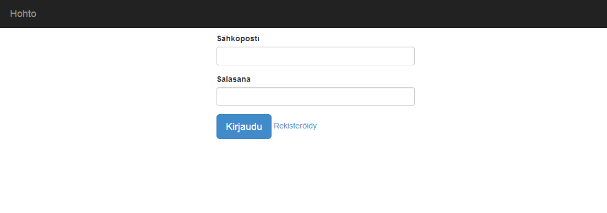
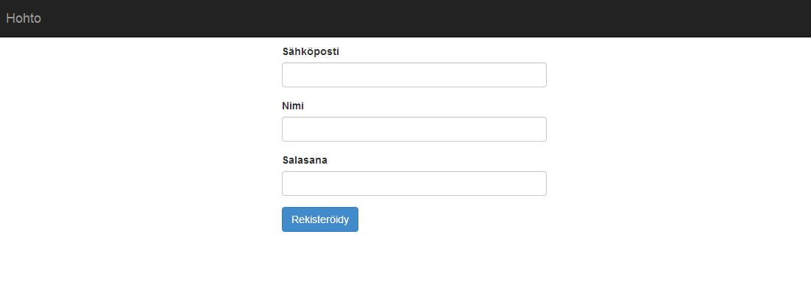
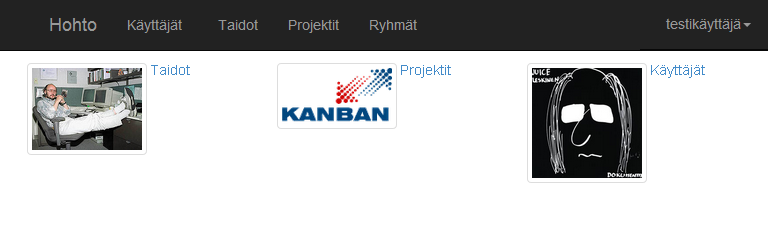
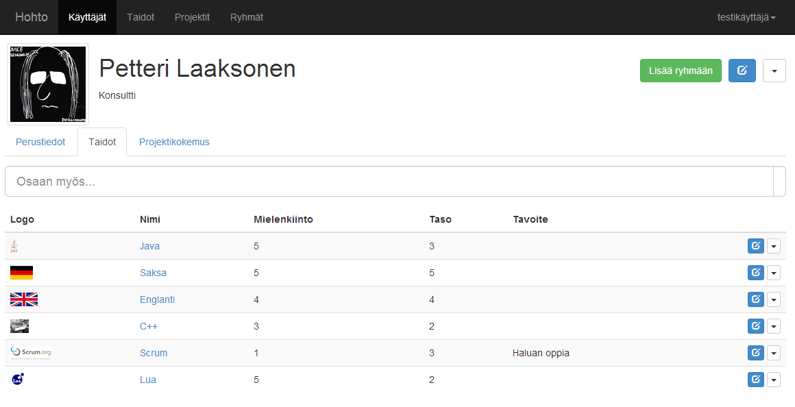
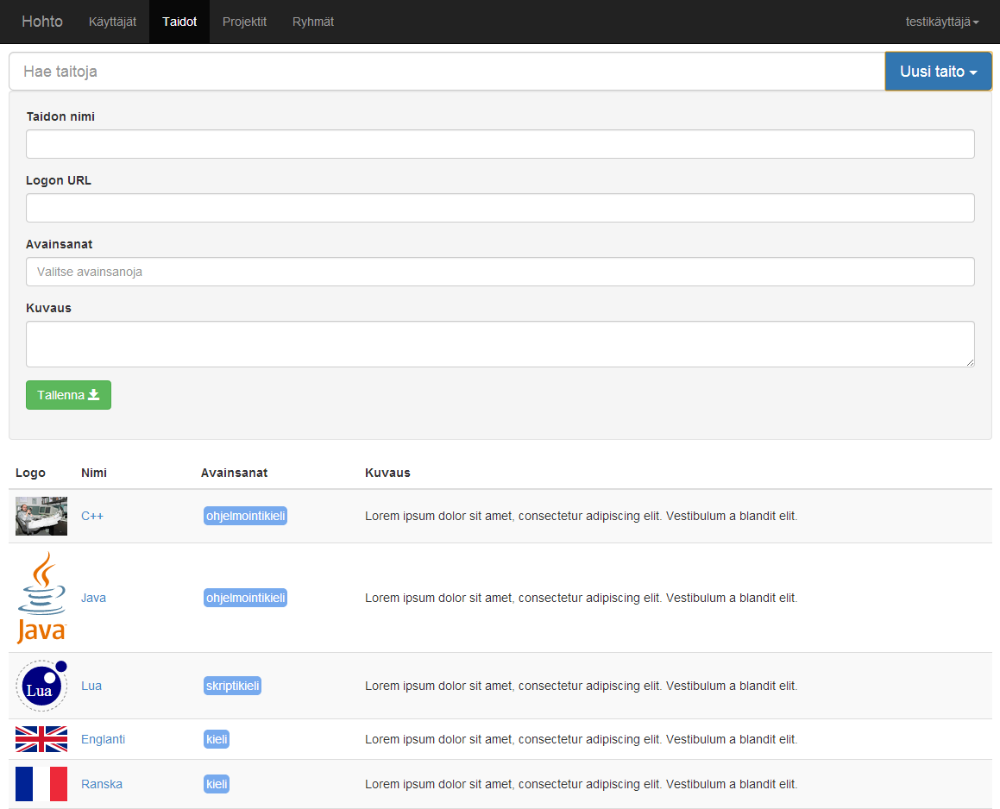
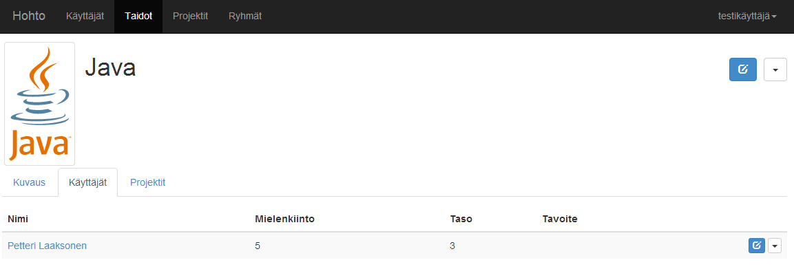
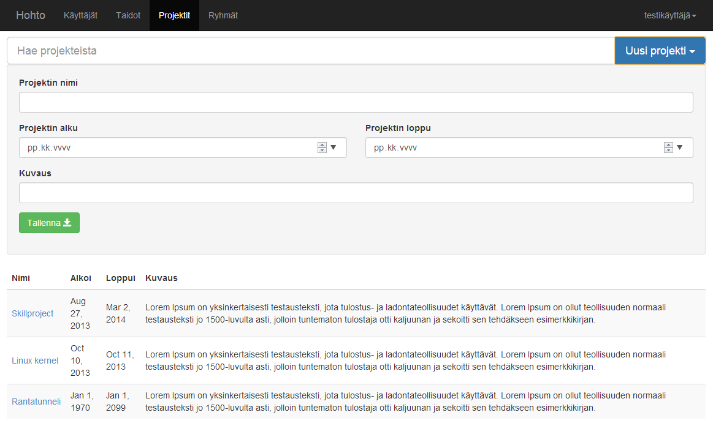
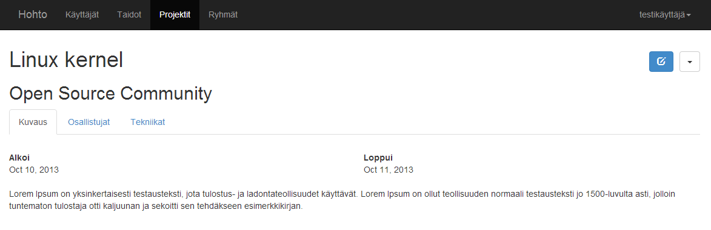
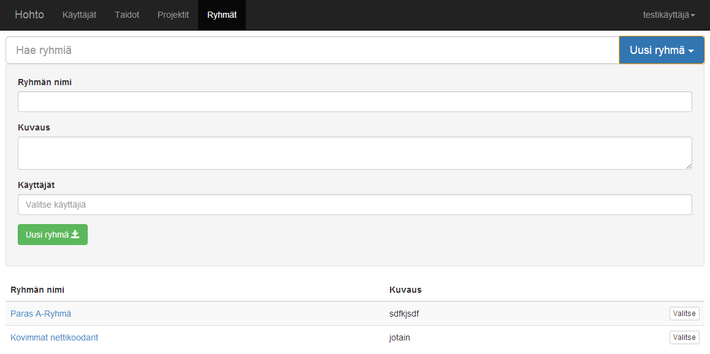
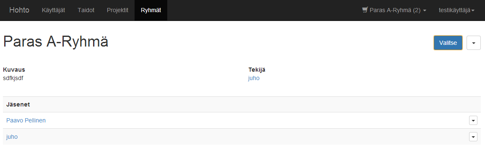

# Versiohistoria {.unnumbered}

----------  ----------  --------------  ---------------------------------------
    Versio  Päiväys     Tekijä          Kuvaus
----------  ----------  --------------  ---------------------------------------
0.1         02.10.2013  Teperi          Dokumentin pohja

0.2         02.10.2013  Tuurinkoski     Otsikoita ja ranskalaisia viivoja

0.2.1       02.10.2013  Tuurinkoski     Lisätty kysymys

0.3         09.10.2013  Peltonen        Laatuvaativuusmäärittelyjä

0.3.1       10.10.2013  Peltonen        Käyttötapauksia

0.4         11.10.2013  Tuurinkoski     Kirjoitettu dokumentti

1.0         11.10.2013  Teperi          Korjattu ulkoasua, lopullinen palautus.

1.1			01.11.2013	Tuurinkoski		Käyttötapausten muokkaamista

1.2			07.11.2013	Tuurinkoski		Muutokset kommenttien pohjalta
----------  ----------  --------------  ---------------------------------------

# Määritelmät ja lyhenteet {.unnumbered}

HOHT
:   Henkilöstön osaamisen hallinnan työkalu

#  Johdanto

## Tarkoitus ja laajuus
Tämän dokumentin tarkoitus on määritellä sovellukselta vaaditut toiminnallisuudet ja niiden prioriteetit. Vaatimusmäärittely on kohdistettu projektityöryhmän lisäksi muille sidosryhmille, joita ovat asiakas Gofore sekä Tietotekniikan projektityön kurssihenkilökunta. Vaatimuksessa esiintyvien määrittelyjen lähtökohdat ovat asiakkaan tarjoama perus- ja lisäominaisuuksien vaatimuslista sekä tapaamisten yhteydessä käydyt keskustelut. Tämän vuoksi dokumentti sisältää jo pidemmälle vietyjä määrittelyjä, jotka vastaavat osittain jo tehtyjä suunnitteluratkaisuja.

## Tuote
Tuote kulkee projektivaiheessa nimellä Henkilöstön osaamisen hallinnan työkalu, joka on asiakkaan tarjoama nimi palvelulle ja on myöhemmin lyhennetty projektityöryhmän toimesta dokumentaatioissa nimeen viittaamisen helpottamiseksi HOHT:ksi. Tuotteen tarkoitus on palvella henkilöstön henkilökohtaisen osaamisen kehityksen työkaluna, mutta sitä tulee myös pystyä käyttämään liiketoiminnan tukemiseen. HOHT tulee Goforen sisäiseen käyttöön. Tuote on itsenäinen web-sovellus, jonka tietokanta ja tuotantoympäristö tulevat olemaan asiakkaan omilla palvelimilla.

#  Yleinen kuvaus

## Toiminnallisuudet
Sovellus jakautuu kolmeen pääkokonaisuuteen: henkilöön (oma profiili), taitoon (esim. ohjelmointikieli, urheilulaji jne.) ja projektiin (sisältää mm. henkilöitä ja taitoja). Henkilö voi lisätä itselleen uusia taitoja ja muokata kiinnostusta, kokemusta ja omaa taitotasoaan kyseisessä taidossa. Lisäksi henkilö voi liittää itsensä projekteihin, jotka kartuttavat henkilön kokemusta esimerkiksi jonkin projektissa käytetyn taidon suhteen. Järjestelmästä voi hakea henkilöitä, taitoja ja projekteja. Henkilöitä voidaan myös selata tietyn taidon tai projektin mukaan.  Käyttäjä voi myös muodostaa ryhmiä henkilöistä, tallentaa ryhmiä ja vertailla henkilöiden osaamista ryhmän sisällä. Sovellus käyttää henkilökohtaista autentikointia, eikä tietokannan sisältöä pääse käsittelemään tai hakuja suorittamaan ilman kirjautumista.

## Käyttäjät
Loppukäyttäjinä toimivat Goforen työntekijät. Yrityksen henkilöstön koulutustaustan huomioonottaen voidaan olettaa, että kyseinen käyttäjäkunta koostuu kokeneista tietokoneen käyttäjistä. Järjestelmässä ei ole erikseen eri käyttäjäryhmiä, mutta tämän mahdollisuus on huomioitu jatkokehitysajatuksissa ja perustoiminnallisuuksien suunnitteluvaiheessa. Järjestelmän odotettu keskimääräinen käyttöaste viikossa on noin 0-5 tuntia käyttäjää kohden.

## Ympäristö ja suunnittelurajoitteet
HOHT on verkkoyhteyden yli toimiva web-sovellus, jota käytetään Internet-selaimella. Tuettuja selaimia ovat Mozilla Firefox, Opera, Google Chrome sekä Internet Explorer 9.0 ja sitä uudemmat versiot. Työpöytäselainten lisäksi käyttöliittymässä ja suorituskyvyssä tulee ottaa huomioon tabletit, älypuhelimet ja muut mobiililaitteet. Toteutuksessa käytetään moderneja web-tekniikoita, kuten JavaScriptiä. Tietokanta toteutetaan MongoDB:llä.

#  Toiminnalliset vaatimukset
Toiminnallisuudet jaetaan vaatimusmäärittelyssä kolmeen kategoriaan: pakollisiin perusominaisuuksiin, mahdollisesti toteutettaviin lisäominaisuuksiin sekä jatkokehitysajatuksiin. Alla listatut toiminnallisuudet ovat prioriteettijärjestyksessä. Projektityöryhmän toimesta kaikki perusominaisuudet tullaan implementoimaan ja lisäominaisuuksia prioriteettijärjestyksessä sen mukaan, miten projektin aikataulu sen sallii.

## Lista vaadituista ominaisuuksista

### Perusominaisuudet
- Järjestelmässä on autentikointi; käyttäjät tekevät henkilökohtaisen käyttäjätunnuksen ja kirjautuvat sillä järjestelmään.
- Kerrallaan sisään kirjautuneiden käyttäjien lukumäärä ei ole rajattu.
- Kaikilla käyttäjillä on samat oikeudet tehdä muutoksia järjestelmään.
- Kaikista muutoksista jää lokimerkintä, mistä ilmenee ainakin muutoksen tehnyt käyttäjätunnus.
- Käyttöliittymän tulee olla responsiivinen, mikä vaikuttaa erityisesti hakutoiminnon luonteeseen.
- Henkilön profiiliin liittyvät toiminnallisuudet
    - Taitojen lisääminen omaan profiiliin ja vastaavasti niiden poistaminen profiilista.
    - Taitoihin liittyviin mittareihin (taitotaso [0-5], kiinnostus [1-5] ja kokemus [kk]) voi tehdä muutoksia omalta profiilisivulta.
    - Henkilön profiilissa on vapaamuotoinen, muokattava "oma kuvaus" -kenttä.
    - Henkilö voi liittää itsensä projektiin, muokata omaa assosiaatiotaan (esim. rooli) projektin välillä sekä poistaa itsensä projektista.
    - Henkilö voi lisätä itselleen profiilikuvan, muokata sitä ja poistaa sen
    	- Profiilikuvan voi tuoda myös Gravatar-palvelun kautta
    - Taidon kokemusmäärä (kk) on mahdollista päivittää automaattisesti projektin kautta (projekti-henkilö-taito -assosiaatio)
    - Henkilö voi poistaa oman profiilinsa järjestelmästä (tiedot jäädytetään, mutta jätetään tietokantaan).
- Taitoon liittyyvät toiminnallisuudet:
    - Taidolla on nimi ja joukko kyseiseen taitoon liittyviä tageja (esim. ohjelmointikieli, urheilulaji jne.).
    - Kuka tahansa voi lisätä järjestelmään uuden taidon, muokata olemassa olevia taitoja tai poistaa taidon järjestelmästä.
    	- Poistamisen ehtona on, että taitoa ei ole linkitetty yhteenkään henkilöön tai projektiin.
    - Yksittäistä taitoa voi kommentoida tarkoituksena jakaa omia kokemuksia tai muuta hyödyllistä tietoa muiden käyttäjien kesken.
    - Yksittäisen taidon tiedoista näkee projektit ja henkilöt, joilla on yhteys taitoon (taito liitetty projektiin, henkilö lisännyt taidon omaan profiiliinsa).
- Projektiin liittyvät toiminnallisuudet:
    - Kuka tahansa voi luoda uuden projektin, muokata projektin tilaa ja poistaa projektin.
    - Projektilla on nimi ja listat henkilöistä ja taidoista.
        - Yksittäisen projektin tiedoista näkee henkilöt ja taidot, jotka on liitetty kyseiseen projektiin.
    - Projektilla on alku- ja loppupäivämäärä ja/tai tila (projektin vaihe).
- Haku:
    - Järjestelmästä voi hakea henkilöitä, projekteja ja taitoja
    - Hakutuloksia pystyy järjestämään eri attribuuttien mukaan
    - Haussa hyödynnetään tageja tulosten rajaamisessa sekä hakusanan automaattista täydennystä
- Käyttäjä voi muodostaa ryhmiä käyttäjistä ja tallentaa ryhmät.
- Ryhmien henkilöitä voi vertailla taitojen perusteella keskenään.
- Tietokannan ylläpitämää tietoa ja statistiikkaa voi tarkastella visuaalisesti graafien ja taulukoiden avulla.

### Lisäominaisuudet
- Taitoihin liittyen toteutetaan Merge-toiminto, jonka avulla taitoja voidaan yhdistää saman kokonaisuuden alle.
   - Tarve tälle voi olla esimerkiksi kirjoitusvirhe taidon nimessä sitä lisättäessä tietokantaan.
- Henkilö voi asettaa itselleen tavoitteen tietyn taidon kehityksessä.
    - Tavoite voi olla taitotason arvon (1-5) korottaminen, kokemuksen hankkiminen (kk) tai osallistuminen projektiin tai koulutukseen, jossa kyseistä taitoa hyödynnetään.
- Henkilö voi lisätä, muokata ja poistaa suoritettuja koulutuksia, kursseja ja sertifikaatteja.
    - Koulutuksilla, kursseilla ja sertifikaateilla voi olla yhteys järjestelmässä oleviin taitoihinn tai projekteihin.
- Henkilö voi täydentää omaa työhistoriaansa (aiemmat työpaikat, muut ulkoiset ja itsenäiset projektit).
- Omasta profiilista voi generoida Goforen sisäistä mallia mukaileva CV PDF-formaatissa.
- Generoitua CV:tä voi muokata ennen sen tulostamista tai tiedostoon tallentamista.
    - Muokkauksia ei tallenneta henkilön profiiliin.

### Jatkokehitysajatukset
- Tavoitteet yhtiön tasolla
    - Esim. tietyn taidon osaajia tarvittaisiin vuoteen x mennessä n kappaletta.
- HOHT integroituu muihin Goforen käyttämiin järjestelmiin.
- Eri käyttäjäryhmien implementointi

## Käyttötapaukset

Nimi
:   Rekisteröityminen

Tuloehdot
:   Käyttäjällä on pääsy järjestelmän verkkosivulle.

Kuvaus
:   Käyttäjä menee järjestelmän pääsivulle. Hän painaa "Rekisteröidy"-nappia, josta aukeaa rekisteröitymissivu. Käyttäjä syöttää sähköpostiosoitteensa, nimensä ja salasanan. Käyttäjä painaa "Rekisteröidy"-nappia. Järjestelmä ilmoittaa, että tunnukset on luotu.

Poikkeukset
:   Annetulla sähköpostilla on jo luotu tunnukset. Sähköposti tai salasana ei läpäise validointia.

Lopputulos
:   Käyttäjällä on palveluun tunnukset, joilla hän voi jatkossa kirjautua sisään.

----------

Nimi
:   Kirjautuminen

Tuloehdot
:   Käyttäjällä on tunnukset järjestelmään.

Kuvaus
:   Käyttäjä menee järjestelmän etusivulle. Käyttäjä kirjoittaa sähköpostiosoitteensa ja salasanansa niille varattuihin kenttiin ja painaa "Kirjaudu"-nappia.

Poikkeukset
:   Käyttäjän antamalla sähköpostilla ei ole rekisteröity tunnusta järjestelmään. Salasana on virheellinen.

Lopputulos
:   Käyttäjä on kirjautunut sisään.

----------

Nimi
:   Oman profiilin muokkaaminen

Tuloehdot
:   Käyttäjä on kirjautunut järjestelmään.

Kuvaus
:	Käyttäjä navigoi itsensä omaan profiiliin oikeasta yläkulmasta avautuvan pudotusvalikon kautta. Näkymään avautuu oma profiilikuva ja välilehdet "Omat tiedot", "Taidot" ja "Projektit", joista "Omat tiedot" on oletuksena aktiivisena. Hän klikkaa oman kuvauksen muokattavaksi, huomatessaan siinä virheen, korjaa tiedot ja viimeistelee muokkaamisen tallentamalla tiedot. Tämän jälkeen käyttäjä klikkaa aktiiviseksi "Taidot" välilehden, josta hän näkee itselle lisätyt taidot. Tätä kautta hän muokkaa taitokohtaisia osaamis-, kokemus- ja kiinnostustasoja ajan tasalle ja poistaa yhden vahingossa itselleen lisäämänsä taidon sen kohdalla olevasta "Poista"-napista. "Projektit" välilehden kautta hän vielä varmistaa, että hänet on linkitetty meneillä oleviin projekteihin. Hän huomaa kuitenkin olevansa osana projektia, jossa hänen ei kuuluisi olla. Listauksesta hän klikkaa "Poista"-nappia kyseisen projektin kohdalta, jonka jälkeen projekti on poistunut hänen tiedoistaan.

Poikkeukset
:   Taidon eri tasojen muokkausten yhteydessä yritetään syöttää epävalidi arvo.

Lopputulos
:   Muutokset on tallennettu järjestelmään. Käyttäjän sähköposti näkyy lokitiedoissa tietojen viimeisimpänä muokkaajana sen taidon ja projektin osalta, joista hän poisti itsensä.

----------

Nimi
:   Taidon lisääminen järjestelmään

Tuloehdot
:   Käyttäjä on kirjautunut järjestelmään.

Kuvaus
:   Käyttäjä menee "Taidot"-sivulle. Käyttäjä painaa "Lisää taito"-nappia, jolloin esiin tulee lomake. Hän täyttää taidon logon URL:n, nimen, kuvauksen ja lisää kategoriatageja, jotka kertovat, minkä tyyppisestä taidosta on kyse. Käyttäjä painaa "Lisää"-nappia ja järjestelmä kertoo, että uusi taito lisättiin onnistuneesti.

Poikkeukset
:   Vastaava taito on jo olemassa. Järjestelmä ehdottaa, että käyttäjän tekemät muutokset yhdistetään jo olemassa olevan taidon kanssa (lisäominaisuus).

Lopputulos
:   Käyttäjän luoma taito on tallennettuna järjestelmään. Käyttäjän sähköposti näkyy lokitiedoissa taidon viimeisimpänä muokkaajana.

----------

Nimi
:   Taidon lisääminen omaan profiiliin

Tuloehdot
:   Käyttäjä on kirjautunut järjestelmään. Haettu taito löytyy järjestelmästä.

Kuvaus
:   Käyttäjä menee "Taidot"-sivulle ja rajaa taitoja nimen tai kategorian perusteella. Saadusta listauksesta hän klikkaa halutun taidon riviltä "Lisää"-nappia. Tämän tuloksena käyttäjä saa täytettäväkseen taitoon liittyvät henkilökohtaiset osaamis-, kokemus- ja kiinnostustasokentät. Kenttien oletusarvoiksi asetetaan nolla (0), mikäli käyttäjä jättää ne tyhjiksi. Lopuksi muutokset tallennetaan. Järjestelmä ilmoittaa, että taito lisättiin onnistuneesti omaan profiiliin.

Poikkeukset
:   Haettu taito on jo lisätty käyttäjän omaan profiiliin.

Lopputulos
:   Haettu taito on lisätty omaan profiiliin.

---------- 

Nimi
:   Taitojen selaaminen ja kommentoiminen

Tuloehdot
:   Käyttäjä on kirjautunut järjestelmään. Taito(ja) löytyy järjestelmästä.

Kuvaus
:   Käyttäjä menee "Taidot"-sivulle. Käyttäjä silmäilee, mitä taitoja on olemassa ja haluaa tutustua tarkemmin yhteen. Hän painaa taidon kohdalla ja pääsee taitonäkymään. Käyttäjä näkee taidon yleisen kuvauksen, listan taidon omaavista käyttäjistä ja listan projekteista, joihin taito on linkitetty omissa välilehdissään. Lisäksi näkymässä on painike, jonka avulla käyttäjä voi lisätä taidon omaan profiiliinsa, mikäli hänellä ei vielä ole kyseistä taitoa. Hän haluaa kommentoida taitoa omien käyttökokemustensa perusteella. Tämä onnistuu klikkaamalla "Kommentoi"-nappia, joka avaa vapaamuotoisen tekstikentän käyttäjälle. Kirjoitettuaan kommenttinsa, käyttäjä painaa "Tallenna"-nappia, jolloin kommentti tallentuu taitonäkymään. Myöhemmin käyttäjä voi vielä käydä muokkaamassa kommenttia tai poistamassa sen.

Poikkeukset
:   -

Lopputulos
:   Kommentti on tallennettu järjestelmään. Käyttäjän sähköposti näkyy lokitiedoissa taidon viimeisimpänä muokkaajana.

----------

Nimi
:   Projektin lisääminen järjestelmään

Tuloehdot
:   Käyttäjä on kirjautunut järjestelmään.

Kuvaus
:	Käyttäjä menee "Projektit"-sivulle sivuston yläpalkin kautta. Näkymässä avautuu rajauskenttä ja listaus järjestelmässä jo olevista projekteista. Näkymässä on myös "Lisää projekti"-nappi. Tätä painamalla käyttäjälle avautuu lomake, johon täytetään projektin nimi, alkamis- ja loppumisajankohta sekä vapaa kuvaus. Projekti tallentuu järjestelmään "Lisää"-nappia painamalla.

Poikkeukset
:   Alkamis- tai loppumispäivämäärä on annettu epävalidissa muodossa. 

Lopputulos
:   Uusi projekti on luotu annetuilla tiedoilla. Käyttäjän sähköposti näkyy lokitiedoissa projektin viimeisimpänä muokkaajana.

----------

Nimi
:   Henkilöhaku taitojen perusteella

Tuloehdot
:   Käyttäjä on kirjautunut järjestelmään.

Kuvaus
:	Yrityksestä halutaan löytää tiettyä taitoa osaava henkilö. Käyttäjä menee "Taidot"-sivulle, jossa on listattuna järjestelmästä löytyvät taidot. Sivun alussa on rajauskenttä, jonka avulla hän rajaa tuloksia kategorian tai taidon nimen perusteella. Rajaustuloksista klikataan halutun taidon yleisnäkymään. Yleisnäkymä tarjoaa listauksen henkilöistä, jotka ovat lisänneet taidon omaan profiiliinsa sekä toisessa välilehdessä projektit, joihin taito on liitetty. Henkilölistauksessa näkyy kunkin henkilön osaaminen, kokemus ja kiinnostus numeerisena arvona. Listauksen yhteydessä on lisäksi toiminnallisuudet nimien kohdalla, jonka avulla käyttäjä voi lisätä henkilön omaan ryhmäänsä tai olemassa olevaan projektiin.

Poikkeukset
:   Haettua taitoa ei ole lisätty järjstelmään. Yksikään käyttäjä ei ole lisännyt taitoa omaan profiiliinsa.

Lopputulos
:   Käyttäjälle on tarjottu listaus henkilöistä, joilla on osaamista, kokemusta tai kiinnostusta haetusta taidosta.

----------

Nimi
:	Uloskirjautuminen

Tuloehdot
:	Käyttäjä on kirjautunut järjestelmään.

Kuvaus
:	Käyttäjä klikkaa oikeassa yläkulmassa olevan pudotusvalikon auki ja valitsee "Kirjaudu ulos" vaihtoehdon. Painalluksen tuloksena käyttäjä kirjautuu ulos järjestelmästä ja palaa kirjautumisnäkymään.

Poikkeukset
:	-

Lopputulos
:	Käyttäjä on kirjautunut ulos järjestelmästä onnistuneesti.

#  Käyttöliittymä
Koska lopputuote on web-palvelu, käyttöliittymä on siinä hyvin olennainen osa. Palvelu toteutetaan yhden sivun sovelluksena, jossa kaikki lataukset tapahtuvat selaimen pysyessä samalla sivulla. Tässä kappaleessa käydään läpi ensin käyttöliittymän yleiset piirteet, sitten kirjautumattoman käyttäjän näkymän ja lopuksi varsinaisessa käytössä vastaan tulevat näkymät, joissa käyttäjä on kirjautuneena.

## Yleisesti
Joka näkymässä on kiinteänä osana sivun ylälaidassa valikkopalkki. Sen vasemmassa laidassa on päätason navigaatio ja oikeassa laidassa kirjautuminen ja rekisteröitymissivulle vievä linkki. Jos käyttäjä on kirjautuneena, oikealla näytetään sen merkiksi käyttäjänimi, jota klikkaamalla saa auki käyttäjään liittyvät toiminnot kuten profiilisivun avaaminen ja uloskirjautuminen.

## Kirjautumattoman etusivu
Sivulla näytetään yläpalkissa ainoastaan palvelun nimi. Näkymässä on kentät sähköpostitunnukselle ja salasanalle sekä napit kirjautumiselle ja uuden tunnuksen rekisteröitymiselle. Työkalun muut valinnat on piilotettu, kunnes käyttäjä on kirjautunut sisään.

## Rekisteröityminen
Rekisteröitymissivu on askeettinen sisältäen pelkästään lomakkeen tietojen syöttämistä varten. Lomakkeessa kysytään vain aivan minimaaliset perustiedot kuten sähköpostiosoite, nimi ja haluttu salasana. Lomakkeen kentät näyttävät käyttäjälle reaaliajassa tiedon siitä, onko niihin syötetty validia tietoa vaihtamalla taustavärikseen punaista tai vihreää asianmukaisesti ja tarjoamalla tooltipin siitä, mikä on vialla. Rekisteröitymisen onnistuttua käyttäjä ohjataan takaisin kirjautumattoman etusivulle, jossa kiitetään rekisteröitymisestä ja kehoitetaan kirjautumaan.

## Kirjautuneen etusivu
Kirjautuneelle käyttäjälle etusivu ei tarjoa juurikaan informaatiota, vaan toimii ponnahduslautana eri toimintoihin. Siellä on suurin kuvakkein varustettuna koko navigaatio mahdollisine alakohtineen.

## Profiilisivu
Käyttäjäprofiili on järjestelmän keskeisin sivu. Se yrittää olla mahdollisimman analoginen Goforella käytettävän CV-mallin kanssa, jotta käyttäjät osaisivat etsiä tietoa heti oikeasta paikasta. Sen ylälaidassa näytetään käyttäjän määrittämä profiilikuva, jonka vieressä on käyttäjän nimi pääotsikkona ja sen alla toiminimike. Näiden alla on käyttäjän vapaa kuvaus itsestään.

Valtaosa sivusta koostuu taulukoista, joissa on listattuna käyttäjän osaamista ja sen konkretisointia. Listaukset on jaettu kategorioidensa mukaisiin välilehtiin. Tämä helpottaa profiilin selaamista ilman edestaikaista rullausta pitkin sivua. Osaamisessa ja kielitaidossa on esitettynä osaamistaso, kokemus (Huom! puuttuu käyttöliittymäkuvasta), tavoite, ja käyttäjän mielenkiinto taitoa kohtaan.

Kaikille käyttäjän osaamisille on suora muokkaus- ja poistomahdollisuus profiilisivulla.

## Taitojen listaus
Näkymä kuuluu palvelun käytetyimpien sivujen joukkoon. Siellä on heti ensimmäisenä vapaa rajauskenttä, josta palveluun syötettyjä taitoja voi suodattaa näkyviin halutuilla kriteereillä. 

Hakupalkin vieressä on nappi, josta saa uuden taidon lisäämisen lomakkeen esiin ja piiloon. Syöttämällä siihen taidon ja painamalla lisäämisnappia uusi taito on syötetty järjestelmään ja näkyy taitojen taulukkolistauksessa, mikäli hakukriteerit sen sallivat.

Pohjimmaisena sivulla on listaus järjestelmään syötetyistä taidoista. Mikäli rajauskenttään on syötetty jotain, taulukkolistaus näyttää vain kyseiset kriteerit täyttävät taidot. Listauksessa taidoista näytetään niihin liitetty logo, nimi, tagit ja vapaa tekstikuvaus. Kunkin taidon nimi toimii linkkinä yksittäisen taidon sivulle. Taulukko on järjestettävissä kunkin sarakkeen suhteen.

## Yksittäinen taito
Taitoa tarkastellessa siitä näytetään käyttäjän profiilisivun kaltaisesti ylhäällä logo ja otsikkona sen nimi. Taidon kuvaus on kokonaisuudessaan näiden alla. Sivun oikeassa reunassa, josta taidon voi lisätä omaan osaamiseensa. Kun taito on lisätty käyttäjälle, tälle näkyy lomake, jolla hän voi taitosivulta käsin muuttaa omaa suhdettaan taitoon: esimerkiksi numeroarvoisesti osaamista ja mielenkiintoa. Käyttäjällä on lisäksi nappi, josta hän voi ottaa taidon pois omasta osaamisestaan. Taidon näkymästä voi myös selata taitoon linkitettyjä henkilöitä ja projekteja välilehtien takaa.

## Projektien listaus
Projektilista on hyvin samankaltainen kuin osaamislista. Ylhäällä on rajauskenttä, jonka vierestä on mahdollisuus ponnauttaa projektinlisäyslomake esiin. Alimpana on taulukkolistaus kriteerit täyttävistä projekteista alkamis- ja loppumisajankohtineen sekä kuvauksineen. Projektin nimi toimii linkkinä yksittäisen projektin sivulle.

## Yksittäinen projekti
Projektisivulla on projektin nimen alla lueteltu määritelmätyylisesti sen määrämuotoiset tiedot: alkamis- ja loppumisajankohta sekä kuvaus. Kuvauksen vieressä on "Osallistujat" ja "Tekniikat" -välilehdet, joissa listataan kaikki projektissa mukana olleet käyttäjät ja heidän projektissa käyttämänsä teknologiat. Kaikista taitojen nimistä pääsee taitosivuille ja käyttäjien nimistä käyttäjäprofiileihin.

## Ryhmien listaus
Ryhmien listaus mukailee taitojen ja projektien listausnäkymiä. Ylälaidassa on tuttu rajauskenttä, jonka vieressä nappi, josta voi lisätä uuden ryhmän. Käyttäjä voi antaa ryhmälle nimen, vapaamuotoisen kuvauksen ja lisätä käyttäjiä rajauskentän avulla. Lomakkeen alareunassa on nappi, jonka avulla ryhmän voi tallentaa järjestelmään. Rajauskentän ja avatun lomakkeen alapuolella näkyy listaus järjestelmästä löytyvistä ryhmistä. Listauksen oikeassa reunassa, kunkin ryhmän kohdalla, on valintapainike, jota painamalla käyttäjä saa kyseisen ryhmän aktiivikseksi ja editoitavaksi. Aktiivinen ryhmä näkyy myös yläpalkissa, käyttäjän pudotusvalikon vasemmalla puolella. Tämän jälkeen hän voi esimerkiksi selata eri käyttäjien profiilisivuja ja lisätä heidät aktiiviseen ryhmään suoraan profiilisivunäkymästä. Ryhmän nimi toimii linkkinä yksittäisen ryhmän näkymään.

## Yksittäinen ryhmä

Yksittäisen ryhmän sivulla nimen alla on vasemmalla puolella kuvaus ja oikealla puolella ryhmän tekijä. Nimen tasalla, oikeassa reunassa, on valintapainike, jolla ryhmän saa aktiiviseksi. Aktiivinen ryhmä näkyy myös yläpalkissa, käyttäjän pudotusvalikon vasemmalla puolella. Oikeasta reunasta löytyy myös pudotusvalikko, jonka takaa ryhmän voi mm. poistaa järjestelmästä. Kuvauksen ja tekijän alapuolelta avautuu ryhmän jäsenistä koostuva lista. Jäsenten nimet toimivat linkkeinä kunkin omalle profiilsivulle.

#  Laatuvaatimukset
Järjestelmän tärkeimmät laatuvaatimukset ja -tavoitteet on esitelty seuraavissa aliluvuissa.

##  Käytettävyys
Palvelun tulee olla helposti käytettävä ja nopeasti opittava. Käyttäjillä oletetaan olevan perustaidot tietotekniikasta, joten aivan perusasioita palvelussa ei tarvitse opastaa. Niiden tulee olla intuitiivisesti ymmärrettävissä. Tavallisimmista ratkaisuista poikkeaviin toimintoihin liitetään ohjetoiminto.
Verkkosovelluksesta tehdään responsiivinen, jotta käyttökokemus on miellyttävä tietokoneen lisäksi myös muilla laitteilla, kuten älypuhelimilla ja tableteilla.
Käytettävyyttä mitataan käytettävyystesteillä. Testiryhmänä toimii palvelun loppukäyttäjiä vastaava käyttäjäryhmä. Tavoitteena on saada palvelu tilaan, jossa kaikki käyttäjätesteissä ilmenneet vakavat ongelmat on korjattu. Lisäksi tavoitteena on, että vähintään 80 % testiryhmästä pitää palvelun käyttöä helppona ja nopeana.

##  Suorituskyky
Sivujen latautumisen vasteajan tulee olla enintään 0,1 sekuntia, jolloin käyttäjä kokee toiminnon välittömäksi. Hakutoiminnoissa vasteaika on enintään 1,0 sekunti. Tiedon yhteenkerääminen graafien piirtoa varten ei ole reaaliaikaista, vaan tiedot päivittyvät joka yö. Palvelun käytön oletetaan keskittyvän työaikaan, kello 6.00 ja 18.00 välille.
Goforella on tällä hetkellä noin 60 työntekijää, mutta se on kasvava yritys. Täten samanaikaisia käyttäjiä tulee voida olla 100 henkilöa kerrallaan. Kapasiteettia tulisi voida kasvattaa tarvittaessa.

##  Luotettavuus
Järjestelmän tulee olla luotettava etenkin oikean tiedon säilymisen kannalta. Kaikkien käyttäjän tekemien muutosten täytyy tallentua järjestelmään. Käyttäjälle on ilmoitettava, jos tieto ei tallentunut onnistuneesti ja mahdollistettava uusi tallentamisyritys ilman, että jo kirjoitettu mutta vielä tallentamaton tieto katoaa. Käyttäjältä on kysyttävä, haluaako hän tallentaa uudet tiedot, jos hän on poistumassa sivulta ilman onnistunutta tallennusta.
Käyttäjä ei voi rikkoa tietokantaa. Käyttäjä ei myöskään vahingossa saa poistaa tietoa. Etenkin isoissa kokonaisuuksissa, kuten taito tai henkilön profiili, tulee varmistaa, että tieto todella halutaan poistaa.
Järjestelmän käyttäjät ovat Goforen työntekijöitä, joten heidän oletetaan olevan hyväntahtoisia järjestelmää käyttäessään. Oletetaan siis, että kukaan ei tahallaan esimerkiksi poista tietoa, jota ei kuulu poistaa, tai lisää väärää tietoa.
Sähkökatkoksen, laitevian tai muun yllättävän syyn seurauksena tietokannan data ei saa kadota lopullisesti.

##  Tietoturva
Järjestelmään pitää rekisteröityä ja olla kirjautunut, jotta tietoja pääsee näkemään ja muokkaamaan. Tietojen viimeisimmästä muokkaajasta jää lokimerkintä.
Järjestelmää pääsee käyttämään vain Goforen työntekijät.

##  Ylläpito ja jatkokehitys
Jatkokehityksen ja koodin ylläpidon helpottamiseksi tuotteen koodin tulee olla luettavaa ja modulaarisesti kehitetty. Lisäominaisuudet on huomioitu jo perusominaisuuksien suunnittelu- ja implementointivaiheissa, jotta niiden lisääminen myöhemmin olisi kohtuullisen helppoa.
Nykyinen arkkitehtuuri, toiminnallisuus ja jatkokehitysajatukset on kuvattu dokumentaatiossa kattavasti, niin että uusikin työryhmä kykenisi jatkamaan projektia sujuvasti.
Järjestelmän datan ylläpitoa voi tehdä kuka tahansa kirjautunut käyttäjä.

##  Toiminnallisuudet
Kun tuote on valmis, vähintään kaikki perustoiminnallisuudet on implementoitu ja niiden on testattu toimivan oikein sekä asiakkaan odottamalla tavalla. Joitain ensimmäisen vaatimuslistauksen lisäominaisuuksia on jo nostettu perusominaisuuksiin suunnittelun alkuvaiheissa (katso luku Toiminnalliset vaatimukset).

# Avoimet kysymykset
- Kirjautuneen käyttäjän etusivu?

# Lähteet

[1] Gofore - Henkilöstön osaamisen hallinnan työkalu, perusvaatimukset. Viitattu 02.10.2013 Saatavilla: http://gofore.com/2013-2014-tietotekniikan-projektityo/
